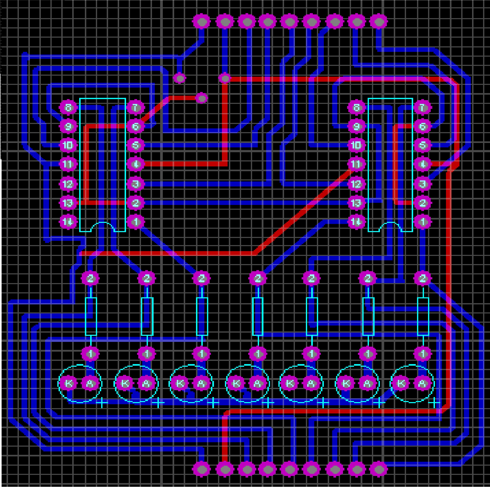
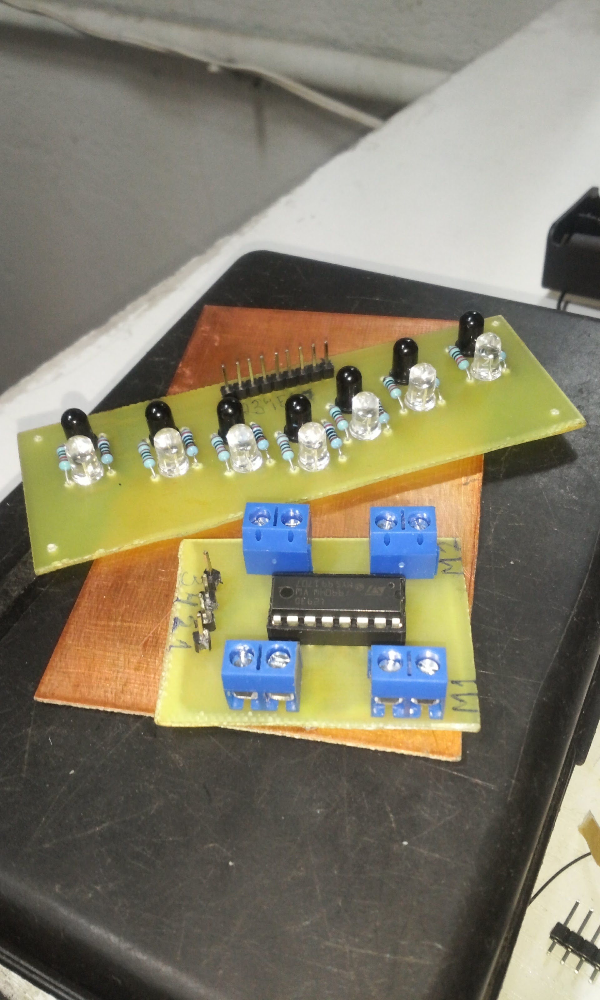
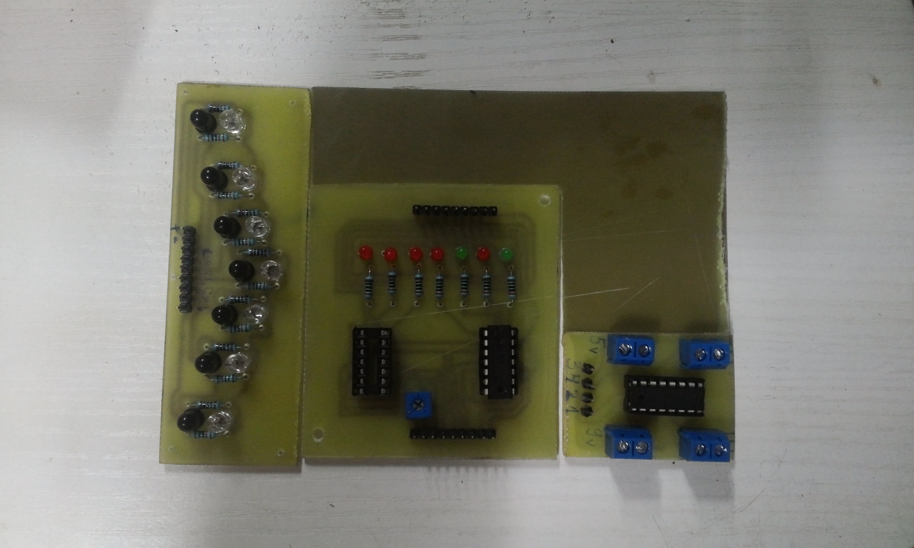
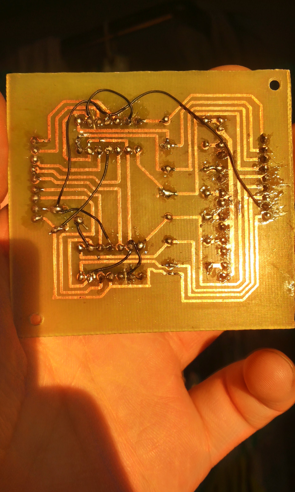
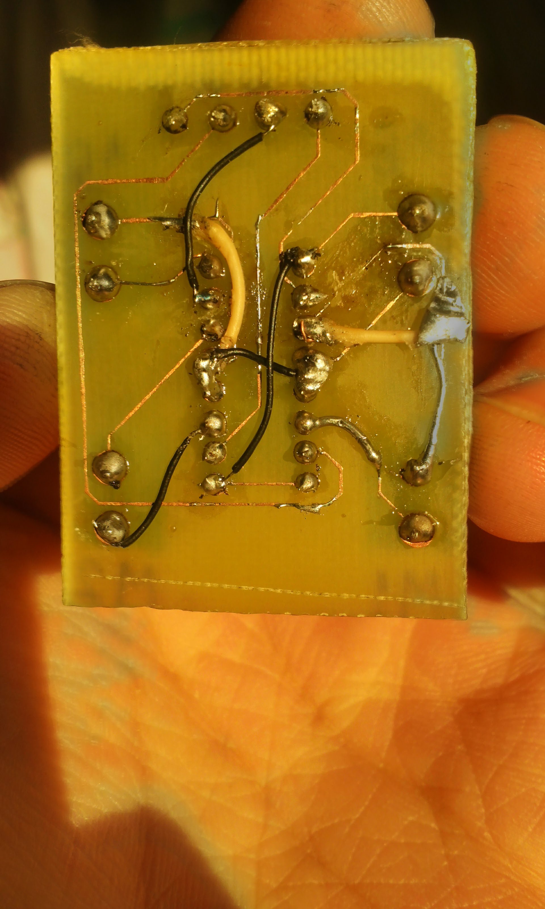
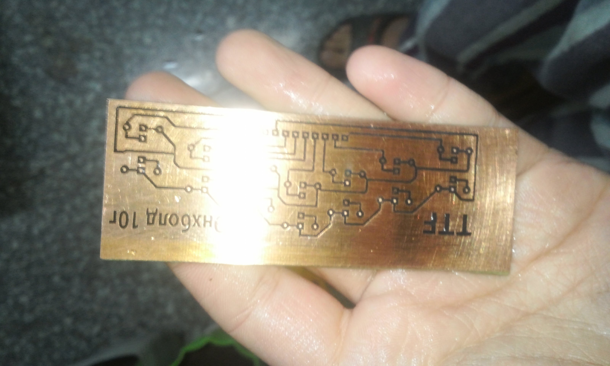
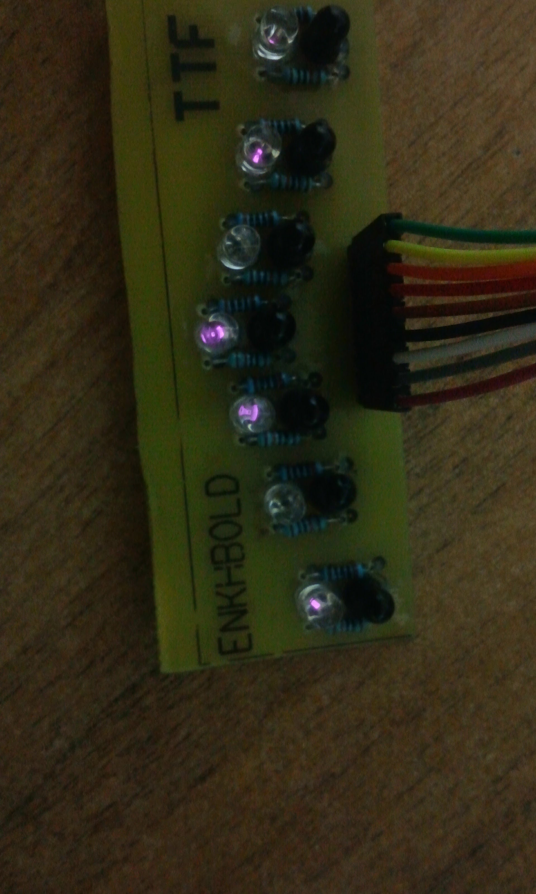

# 2nd line follower robot build

After participating line follower competition, I decided to build something much workable. So, I started building with PCB. Here are some PCB pictures

PCB in Proteus

